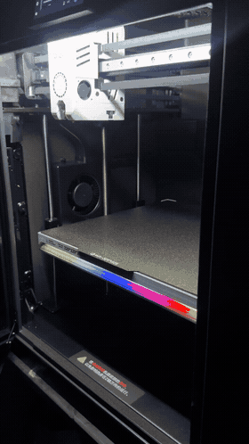
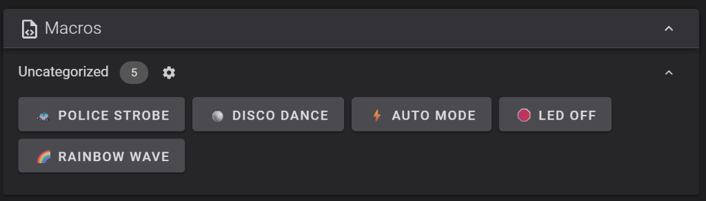

# 🚨 Qidi Plus 5 - RGB Effects Mod (Pink Progress, Police Strobe, Disco Dance & Rainbow 24/7)

<div align="center">

[](https://github.com/Klipper3d/klipper)
[](LICENSE)
[-orange.svg)](https://qidi3d.com)
[](https://github.com/tonngodoc/qidi-plus5-rgb)

**[🇬🇧 English](#-english) | [🇻🇳 Tiếng Việt](#-tiếng-việt)**

<br>


<br>


*Live demonstration video on printer & Interactive Macro Buttons on Fluidd Web UI*<br>
*Video hiệu ứng thực tế trên máy in & Cụm nút bấm Macro trên giao diện Fluidd Dashboard*<br>
<sub><a href="images/qidi_plus5_rgb_demo.mp4">🎬 Watch original 1080p MP4 Video / Xem video gốc</a></sub>

</div>

---

## 🇬🇧 ENGLISH

Professional NeoPixel underbed LED & chamber light effects mod for **Qidi Plus 5** 3D Printer (and compatible Qidi Klipper machines powered by RK3308).

### 🌟 Key Features

- 🌸 **Dynamic Deep Pink Breathing Progress Bar:** Real-time print progress indicator that breathes in vibrant Deep Pink (`#FF0080`) as layers advance, while unprinted LEDs stay completely black.
- 🚓 **Police Strobe (`CANHSATHINHSU`):** High-visibility split double strobe (Left Blue $\leftrightarrow$ Right Red) for urgent notifications or filament runout.
- 🪩 **Disco Dance (`DISCODANCE`):** Synchronized underbed strobe and chamber light pulse to celebrate completed prints.
- 🌈 **Rainbow Wave 24/7 (`RGB_RAINBOW`):** Smooth flowing 7-color rainbow wave that stays active continuously, bypassing the 30-second screen-sleep shutoff.

| G-code Macro | Fluidd Button | Description |
| :--- | :--- | :--- |
| `CANHSATHINHSU` | 🚓 **POLICE STROBE** | Double split flash: Left Blue (0.2s/0.05s) $\rightarrow$ Right Red (0.2s/0.05s) x 10 cycles (10s total), then automatically restores Rainbow wave. |
| `DISCODANCE` | 🪩 **DISCO DANCE** | Split Blue/Red underbed double strobe synchronized with the chamber light (`caselight`) on the beat x 10 cycles, restores previous chamber light state, and returns to Rainbow wave. |
| `RGB_RAINBOW` | 🌈 **RAINBOW WAVE** | Smooth flowing 7-color rainbow wave, **with full bypass of the 30-second screen-sleep LED shutoff issue**! |
| `RGB_AUTO` | ⚡ **AUTO MODE** | Restores auto lighting: Deep Pink breathing progress bar during active printing (remaining LEDs off). |
| `RGB_OFF` | 🛑 **LED OFF** | Completely powers off the underbed NeoPixel strip. |

### 🚀 Quick 1-Line Installation

SSH into your printer (via PuTTY, Termius, or PowerShell):
```bash
ssh qidi@<PRINTER_IP>
# Default password: qiditech
```

Run this single command:

```bash
curl -sSL https://raw.githubusercontent.com/tonngodoc/qidi-plus5-rgb/main/install.sh | bash
```

> **Manual Git clone method:**
```bash
cd ~
git clone https://github.com/tonngodoc/qidi-plus5-rgb.git
cd qidi-plus5-rgb
bash install.sh
```

### 🎛️ Slicer Integration (OrcaSlicer / QidiStudio / PrusaSlicer)

Add visual cues directly into your print lifecycle:

#### 1. Print Finished Alert
In **Printer Settings** $\rightarrow$ **Machine G-code** $\rightarrow$ **End G-code** (after `PRINT_END`):
```gcode
# Trigger 10 seconds of Disco Celebration:
DISCODANCE
```

#### 2. Filament Runout / Pause Alert
In **Pause G-code**:
```gcode
# Flash urgent police lights across the room:
CANHSATHINHSU
```

### 🗑️ Uninstallation

To cleanly restore 100% factory original state:
```bash
cd ~/qidi-plus5-rgb && bash uninstall.sh
```

---

## 🇻🇳 TIẾNG VIỆT

Bộ mod hiệu ứng LED gầm (NeoPixel) và đèn thùng máy chuyên nghiệp cho máy in 3D **Qidi Plus 5** (và các dòng máy Qidi chạy Klipper trên vi xử lý RK3308 tương thích).

### 🌟 Tính Năng Nổi Bật

- 🌸 **Thanh tiến trình Thở Hồng Đậm (Deep Pink Breathing):** Hiển thị % tiến độ in trực quan theo thời gian thực — các bóng đã in nhấp nháy thở màu Hồng Đậm (`#FF0080`), các bóng chưa in tắt đen hoàn toàn.
- 🚓 **Cảnh Sát Hình Sự (`CANHSATHINHSU`):** Chớp kép phân vùng Trái Xanh $\leftrightarrow$ Phải Đỏ báo động khẩn cấp hoặc hết nhựa.
- 🪩 **Disco Dance (`DISCODANCE`):** Chớp kép gầm Xanh/Đỏ kết hợp nhịp nhàng với đèn thùng máy báo hiệu hoàn thành bản in.
- 🌈 **Cầu Vồng 7 Màu 24/7 (`RGB_RAINBOW`):** Sóng màu lượn sóng sáng liên tục, khắc phục triệt để lỗi tự tắt đèn khi màn hình cảm ứng ngủ sau 30 giây.

| Lệnh G-code | Nút Bấm Fluidd | Chi Tiết Hoạt Động |
| :--- | :--- | :--- |
| `CANHSATHINHSU` | 🚓 **POLICE STROBE** | Chớp kép Trái Xanh (0.2s/0.05s) $\rightarrow$ Phải Đỏ (0.2s/0.05s) x 10 chu kỳ (10 giây), kết thúc tự động trở về Cầu vồng 7 màu. |
| `DISCODANCE` | 🪩 **DISCO DANCE** | Chớp kép gầm Xanh/Đỏ kết hợp chớp nhịp nhàng với đèn thùng máy (`caselight`) x 10 chu kỳ, khôi phục trạng thái ban đầu của đèn thùng và trở về Cầu vồng. |
| `RGB_RAINBOW` | 🌈 **RAINBOW WAVE** | Bật hiệu ứng sóng cầu vồng mượt mà, **khắc phục triệt để lỗi tắt đèn khi màn hình cảm ứng ngủ sau 30s**! |
| `RGB_AUTO` | ⚡ **AUTO MODE** | Khôi phục chế độ tự động: Thanh tiến trình nhấp nháy thở màu Hồng Đậm theo % in, phần còn lại tắt đen. |
| `RGB_OFF` | 🛑 **LED OFF** | Tắt hoàn toàn dải LED gầm. |

### 🚀 Cài Đặt Nhanh (1 Dòng Lệnh Duy Nhất)

Mở Terminal SSH vào máy in (sử dụng PuTTY, Termius, hoặc PowerShell):
```bash
ssh qidi@<IP_MÁY_IN>
# Mật khẩu mặc định: qiditech
```

Dán lệnh sau để cài đặt tự động toàn bộ:

```bash
curl -sSL https://raw.githubusercontent.com/tonngodoc/qidi-plus5-rgb/main/install.sh | bash
```

> **Cách clone thủ công từ Git:**
```bash
cd ~
git clone https://github.com/tonngodoc/qidi-plus5-rgb.git
cd qidi-plus5-rgb
bash install.sh
```

### 🎛️ Tích Hợp Vào Phần Mềm Slicer (OrcaSlicer / QidiStudio / PrusaSlicer)

Bạn có thể chèn các hiệu ứng này vào kịch bản G-code của Slicer để máy báo hiệu cực kỳ trực quan:

#### 1. Báo hoàn tất in (Print Finished Notification)
Trong **Printer Settings** $\rightarrow$ **Machine G-code** $\rightarrow$ **End G-code** (sau lệnh `PRINT_END`):
```gcode
# Nhảy Disco hoặc nháy Cảnh sát 10 giây báo hiệu in xong:
DISCODANCE
```

#### 2. Báo hết nhựa / Cần can thiệp (Filament Runout / Pause)
Trong **Pause G-code**:
```gcode
# Nhấp nháy cảnh sát khẩn cấp báo hết nhựa hoặc tạm dừng:
CANHSATHINHSU
```

### 🗑️ Gỡ Cài Đặt (Uninstall)

Khôi phục máy in về trạng thái xuất xưởng 100%:
```bash
cd ~/qidi-plus5-rgb && bash uninstall.sh
```

---

## 📜 License

Released under the [MIT License](LICENSE) - Free and open-source for the entire 3D printing community.
